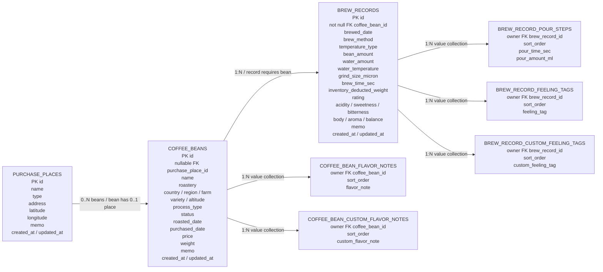

# BrewLog

BrewLog는 커피 원두, 브루잉 레시피, 맛 기록, 원산지와 카페 방문 지도를 함께 관리하는 개인용 웹 애플리케이션입니다. 현재는 원두 관리, 브루잉 기록, 원산지 세계 지도, 카페 지도 흐름을 중심으로 구현하고 있으며, 브루잉에 사용한 원두의 재고 차감까지 연결되어 있습니다.

## 기술 스택

| 구분 | 기술 |
| --- | --- |
| Language | Java 21 |
| Framework | Spring Boot 4.0.6 |
| View | Thymeleaf |
| Persistence | Spring Data JPA |
| Database | H2 Database |
| Validation | Bean Validation |
| Build | Gradle |
| Utility | Lombok |

## 현재 진행 상황

### 원두 관리

- 원두 목록, 등록, 상세 조회, 수정, 삭제
- 원두 이름 검색
- 원두 목록 카드형 UI 적용
- 원두 상태 구분: 보유 중, 소진 기록, 카페 음용
- 원산지, 농장, 품종, 가공 방식, 고도, 로스팅일, 구매일, 가격, 남은 무게 기록
- 원두 분쇄도는 브루잉 기록에서 마이크론미터 단위로 입력
- 원두 향미 노트 저장
- 정해진 향미 노트 선택과 사용자 직접 입력 향미 노트 저장
- 선택한 향미 노트를 별도 영역에 표시해 선택 상태를 인지할 수 있도록 개선
- 구매처 선택 또는 신규 구매처 입력 후 원두와 연결
- 구매처 주소와 지도 연동을 위한 위도, 경도 필드 준비

### 브루잉 기록

- 브루잉 기록 목록, 등록, 상세 조회, 수정, 삭제
- 원두 선택 후 브루잉 기록 작성
- 브루잉 방식, HOT/ICE, 원두량, 물량, 물 온도, 분쇄도, 총 추출 시간 기록
- 맛 점수 6축 기록: 산미, 단맛, 쓴맛, 바디감, 향, 밸런스
- 상세 화면에서 맛 점수를 6각형 차트로 시각화
- 감정/느낌 태그 선택과 사용자 직접 입력 태그 저장
- 선택한 태그를 별도 영역에 표시해 선택 상태를 인지할 수 있도록 개선
- 푸어링 타임라인 입력
- 기본 종료 시간 3분, 사용자가 입력한 종료 시간을 타임라인 끝으로 사용
- 푸어링 카드는 드래그 앤 드랍으로 순서와 시작 시간을 조정
- 드래그 앤 드랍은 5초 단위로 보정
- 상세 화면에서 푸어링 레시피를 시간-물량 그래프로 표시
- 누적 물량 곡선 그래프로 레시피 흐름을 더 쉽게 볼 수 있도록 개선
- 브루잉에 사용한 원두가 보유 중인 원두라면 사용량만큼 남은 무게 자동 차감
- 브루잉 기록 수정/삭제 시 기존 차감량을 복원한 뒤 새 차감량을 반영

### 공통 및 개발 환경

- 루트 페이지를 원산지 세계 지도 메인 화면으로 제공
- 서버 실행 시 개발용 더미 데이터 생성
- H2 콘솔 접속
- 주요 서비스/컨트롤러 흐름 테스트

### 원산지 세계 지도

- `/`에서 경험한 원두의 원산지를 세계 지도에 표시
- 경험한 원두 수에 따라 국가 색상 단계 적용
- 국가 클릭 시 선택 국가 패널 표시
- 선택 국가 패널에서 경험 원두 수, 브루잉 기록 수, 최근 원두 목록 확인
- 최근 원두 카드에 향미 노트 기반 그라데이션 표시
- 국가별 원두 보기 버튼으로 원두 목록을 국가 필터 상태로 이동
- 작은 국가도 확인할 수 있도록 확대/축소 지원
- 확대 후 드래그로 지도 이동 가능
- 마우스 휠 확대 속도를 낮춰 세밀하게 조작 가능

### 카페 지도

- `/cafes/map`에서 방문 또는 기록한 카페를 대한민국 지도에 표시
- 카카오맵 SDK 실험 후 현재는 서비스 디자인에 맞춘 커스텀 SVG 지도 UI 사용
- 전체 지도에서는 지역별 방문 카페 수에 따라 색상 단계 적용
- 전체 지도에서 지역 클릭 또는 충분한 확대 후 지역 진입
- 지역 상세 지도에서는 해당 지역의 카페 마커와 카페 목록 표시
- 상세 지도에서 축소하면 전체 지도 화면으로 복귀
- 전체 지도 확대 후 드래그 이동 가능
- 확대 상태에서도 지역 클릭이 가능하도록 클릭 차단 로직 제거
- 상세 지도 마커는 작은 지도 핀 형태로 표시
- 현재 지도 데이터는 로컬 TopoJSON 기반이며, 일부 행정구역 상세 데이터는 단순화되거나 누락될 수 있음

## 현재 ERD

아래 ERD는 현재 JPA 매핑 기준입니다. `CoffeeBean`, `BrewRecord`, `PurchasePlace`만 독립 엔티티이고, 향미 노트, 느낌 태그, 푸어링 단계는 `@ElementCollection` 값 컬렉션으로 별도 테이블에 저장됩니다.



## 프로젝트 구조

```text
coffee_project
├── README.md
└── coffee
    ├── build.gradle
    └── src
        ├── main
        │   ├── java/com/hsg/coffee
        │   │   ├── CoffeeApplication.java
        │   │   ├── domain
        │   │   │   ├── brewRecord
        │   │   │   │   ├── controller
        │   │   │   │   ├── dto
        │   │   │   │   ├── entity
        │   │   │   │   ├── repository
        │   │   │   │   └── service
        │   │   │   ├── coffeeBean
        │   │   │   │   ├── controller
        │   │   │   │   ├── dto
        │   │   │   │   ├── entity
        │   │   │   │   ├── repository
        │   │   │   │   └── service
        │   │   │   ├── cafeMap
        │   │   │   │   ├── controller
        │   │   │   │   ├── dto
        │   │   │   │   └── service
        │   │   │   ├── dashboard
        │   │   │   ├── originMap
        │   │   │   │   ├── controller
        │   │   │   │   ├── dto
        │   │   │   │   ├── entity
        │   │   │   │   └── service
        │   │   │   └── purchasePlace
        │   │   │       ├── entity
        │   │   │       ├── repository
        │   │   │       └── service
        │   │   └── global
        │   │       ├── config
        │   │       └── entity
        │   └── resources
        │       ├── application.yml
        │       ├── static/css
        │       ├── static/data
        │       ├── static/js
        │       └── templates
        └── test
```

## 실행 방법

Java 21이 필요합니다.

```bash
java -version
```

애플리케이션 실행:

```bash
cd coffee
./gradlew bootRun
```

브라우저 접속:

```text
http://localhost:8080
```

주요 화면:

```text
http://localhost:8080/
http://localhost:8080/coffee-beans
http://localhost:8080/brew-records
http://localhost:8080/cafes/map
```

## 빌드 및 테스트

```bash
cd coffee
./gradlew clean build
```

테스트는 원두와 브루잉 기록의 레포지토리, 서비스, 컨트롤러 흐름을 확인합니다. 테스트 콘솔 출력은 UTF-8 기준으로 설정되어 있습니다.

## 개발 데이터베이스

현재 개발 단계에서는 인메모리 H2를 사용합니다. 서버를 재시작하면 데이터가 초기화됩니다.

```yaml
spring:
  datasource:
    url: jdbc:h2:mem:brewlog
```

H2 콘솔:

```text
http://localhost:8080/h2-console
```

접속 정보:

```text
JDBC URL: jdbc:h2:mem:brewlog
User Name: sa
Password:
```

## 구매처 정책

구매처 정보는 선택 입력입니다.

- 구매처를 남기지 않아도 원두 저장 가능
- 기존에 등록된 구매처가 있으면 선택해서 연결 가능
- 기존 구매처를 선택하지 않고 구매처 이름을 입력하면 새 구매처 생성
- 사용자는 주소까지만 입력
- 카페 유형 구매처는 위도, 경도가 있으면 카페 지도에 표시
- 위도, 경도는 현재 개발용 더미 데이터에 포함되어 있으며, 추후 주소 변환 또는 지도 API 연동으로 자동 저장 예정

## 다음 구현 스텝: 원두 카드 이미지 자동 입력

`docs/specs/coffee_bean_card_image_extraction_spec_v1.md` 기준으로 원두 정보 카드 이미지를 업로드하면 원두 등록 폼을 자동으로 채워주는 기능을 구현합니다.

핵심 원칙:

- 사진 업로드 결과는 바로 DB에 저장하지 않음
- OCR/파싱 결과는 `CoffeeBeanCreateForm`을 채우는 임시 후보로만 사용
- 최종 저장은 사용자가 확인하고 수정한 뒤 기존 `POST /coffee-beans` 흐름으로만 처리
- 1차 구현은 실제 OCR 연동 전 Mock OCR로 전체 흐름을 먼저 검증
- MVP에서는 업로드 이미지를 저장하지 않고 텍스트 추출 결과만 화면에 표시

구현 순서:

1. DTO와 인터페이스 추가
   - `CoffeeBeanCardExtractResult`
   - `CoffeeBeanCardTextParseResult`
   - `CoffeeBeanCardOcrService`

2. Mock OCR 기반 추출 흐름 추가
   - `MockCoffeeBeanCardOcrService`
   - `CoffeeBeanCardExtractionService`
   - `CoffeeBeanCardTextParser` 기본 구조
   - 이미지 파일 유효성 검증: 빈 파일, 이미지 타입, 5MB 제한

3. 원두 등록 컨트롤러 연동
   - `POST /coffee-beans/card-extraction` 추가
   - 업로드 이미지를 OCR/파싱 처리한 뒤 기존 원두 등록 폼으로 재렌더링
   - 원두 등록 폼 옵션 데이터를 공통 메서드로 분리
   - 해당 URL에서는 DB 저장을 하지 않도록 보장

4. 원두 등록 화면 UI 추가
   - `coffee-beans/form.html` 상단에 사진 업로드 영역 추가
   - 추출된 rawText 표시 영역 추가
   - 추출 실패 또는 일부 누락 경고 메시지 표시
   - 자동 입력된 값은 사용자가 직접 수정 가능하게 유지

5. 규칙 기반 텍스트 파서 구현
   - 가공 방식, 용량, 가격, 로스팅 날짜 추출
   - 국가 코드와 국가명 매핑
   - 향미 노트 enum 및 사용자 입력 향미 후보 매핑
   - 원두명과 로스터리 후보 추출
   - 불확실하거나 실패한 항목은 warning으로 반환

6. 테스트와 수동 검증
   - 파서 단위 테스트
   - 추출 서비스 테스트
   - `POST /coffee-beans/card-extraction` 컨트롤러 테스트
   - 업로드 후 자동 입력, 수정, 기존 등록 저장 흐름 수동 확인

7. 실제 OCR 연동 확장
   - Tesseract.js, PaddleOCR, OCR.space, Google Vision OCR 중 선택
   - `CoffeeBeanCardOcrService` 구현체만 교체할 수 있게 유지
   - 외부 API 키는 서버 설정으로만 관리하고 프론트에 노출하지 않음

8. 이후 LLM 구조화 확장
   - OCR rawText를 JSON 후보로 구조화
   - 확실하지 않은 값은 `null` 또는 warning으로 처리
   - 웹은 Thymeleaf 폼 재렌더링, 앱은 `POST /api/coffee-beans/card-extraction`로 확장

## 개발 로드맵

1. 원두 목록과 브루잉 목록의 디자인 일관성 추가 개선
2. 원두 카드 이미지 기반 자동 입력 MVP 구현
3. 구매처 관리 화면 분리
4. 카페 지도 행정구역 데이터 정밀도 개선
5. 카페 음용 원두와 구매 원두의 입력 흐름 분리
6. 브루잉 기록 카드 디자인을 노트형 UI로 개선
7. 브루잉 기록 기반 통계 대시보드
8. 원두와 브루잉 기록 검색, 필터, 정렬 개선
9. 파일 기반 DB 또는 운영 DB 전환
