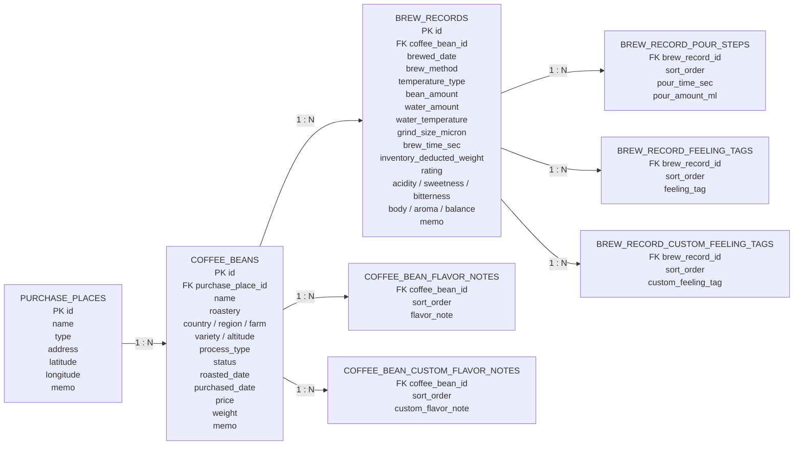

# BrewLog

BrewLog는 커피 원두, 브루잉 레시피, 맛 기록을 함께 관리하는 개인용 웹 애플리케이션입니다. 현재는 원두 관리와 브루잉 기록 작성 흐름을 중심으로 구현하고 있으며, 브루잉에 사용한 원두의 재고 차감까지 연결되어 있습니다.

## 기술 스택

| 구분 | 기술 |
| --- | --- |
| Language | Java 21 |
| Framework | Spring Boot 4.0.6 |
| View | Thymeleaf |
| Persistence | Spring Data JPA |
| Database | H2 Database |
| Validation | Bean Validation |
| Build | Gradle |
| Utility | Lombok |

## 현재 진행 상황

### 원두 관리

- 원두 목록, 등록, 상세 조회, 수정, 삭제
- 원두 이름 검색
- 원두 목록 카드형 UI 적용
- 원두 상태 구분: 보유 중, 소진 기록, 카페 음용
- 원산지, 농장, 품종, 가공 방식, 고도, 로스팅일, 구매일, 가격, 남은 무게 기록
- 원두 분쇄도는 브루잉 기록에서 마이크론미터 단위로 입력
- 원두 향미 노트 저장
- 정해진 향미 노트 선택과 사용자 직접 입력 향미 노트 저장
- 선택한 향미 노트를 별도 영역에 표시해 선택 상태를 인지할 수 있도록 개선
- 구매처 선택 또는 신규 구매처 입력 후 원두와 연결
- 구매처 주소와 지도 연동을 위한 위도, 경도 필드 준비

### 브루잉 기록

- 브루잉 기록 목록, 등록, 상세 조회, 수정, 삭제
- 원두 선택 후 브루잉 기록 작성
- 브루잉 방식, HOT/ICE, 원두량, 물량, 물 온도, 분쇄도, 총 추출 시간 기록
- 맛 점수 6축 기록: 산미, 단맛, 쓴맛, 바디감, 향, 밸런스
- 상세 화면에서 맛 점수를 6각형 차트로 시각화
- 감정/느낌 태그 선택과 사용자 직접 입력 태그 저장
- 선택한 태그를 별도 영역에 표시해 선택 상태를 인지할 수 있도록 개선
- 푸어링 타임라인 입력
- 기본 종료 시간 3분, 사용자가 입력한 종료 시간을 타임라인 끝으로 사용
- 푸어링 카드는 드래그 앤 드랍으로 순서와 시작 시간을 조정
- 드래그 앤 드랍은 5초 단위로 보정
- 상세 화면에서 푸어링 레시피를 시간-물량 그래프로 표시
- 누적 물량 곡선 그래프로 레시피 흐름을 더 쉽게 볼 수 있도록 개선
- 브루잉에 사용한 원두가 보유 중인 원두라면 사용량만큼 남은 무게 자동 차감
- 브루잉 기록 수정/삭제 시 기존 차감량을 복원한 뒤 새 차감량을 반영

### 공통 및 개발 환경

- 루트 대시보드 페이지 제공
- 서버 실행 시 개발용 더미 데이터 생성
- H2 콘솔 접속
- 주요 서비스/컨트롤러 흐름 테스트

## 현재 ERD

아래 ERD는 현재 JPA 엔티티 기준입니다. 향미 노트, 느낌 태그, 푸어링 단계는 `@ElementCollection`으로 관리되어 별도 테이블에 저장됩니다.



## 프로젝트 구조

```text
coffee_project
├── README.md
└── coffee
    ├── build.gradle
    └── src
        ├── main
        │   ├── java/com/hsg/coffee
        │   │   ├── CoffeeApplication.java
        │   │   ├── domain
        │   │   │   ├── brewRecord
        │   │   │   │   ├── controller
        │   │   │   │   ├── dto
        │   │   │   │   ├── entity
        │   │   │   │   ├── repository
        │   │   │   │   └── service
        │   │   │   ├── coffeeBean
        │   │   │   │   ├── controller
        │   │   │   │   ├── dto
        │   │   │   │   ├── entity
        │   │   │   │   ├── repository
        │   │   │   │   └── service
        │   │   │   ├── dashboard
        │   │   │   └── purchasePlace
        │   │   │       ├── entity
        │   │   │       ├── repository
        │   │   │       └── service
        │   │   └── global
        │   │       ├── config
        │   │       └── entity
        │   └── resources
        │       ├── application.yml
        │       ├── static/css
        │       └── templates
        └── test
```

## 실행 방법

Java 21이 필요합니다.

```bash
java -version
```

애플리케이션 실행:

```bash
cd coffee
./gradlew bootRun
```

브라우저 접속:

```text
http://localhost:8080
```

주요 화면:

```text
http://localhost:8080/coffee-beans
http://localhost:8080/brew-records
```

## 빌드 및 테스트

```bash
cd coffee
./gradlew clean build
```

테스트는 원두와 브루잉 기록의 레포지토리, 서비스, 컨트롤러 흐름을 확인합니다. 테스트 콘솔 출력은 UTF-8 기준으로 설정되어 있습니다.

## 개발 데이터베이스

현재 개발 단계에서는 인메모리 H2를 사용합니다. 서버를 재시작하면 데이터가 초기화됩니다.

```yaml
spring:
  datasource:
    url: jdbc:h2:mem:brewlog
```

H2 콘솔:

```text
http://localhost:8080/h2-console
```

접속 정보:

```text
JDBC URL: jdbc:h2:mem:brewlog
User Name: sa
Password:
```

## 구매처 정책

구매처 정보는 선택 입력입니다.

- 구매처를 남기지 않아도 원두 저장 가능
- 기존에 등록된 구매처가 있으면 선택해서 연결 가능
- 기존 구매처를 선택하지 않고 구매처 이름을 입력하면 새 구매처 생성
- 사용자는 주소까지만 입력
- 위도, 경도는 엔티티에 준비되어 있으며 추후 지도 연동 또는 주소 변환으로 자동 저장 예정

## 개발 로드맵

1. 원두 목록과 브루잉 목록의 디자인 일관성 추가 개선
2. 구매처 관리 화면 분리
3. 지도 연동으로 구매처 위치 표시
4. 카페 음용 원두와 구매 원두의 입력 흐름 분리
5. 브루잉 기록 기반 통계 대시보드
6. 원두와 브루잉 기록 검색, 필터, 정렬 개선
7. 파일 기반 DB 또는 운영 DB 전환
