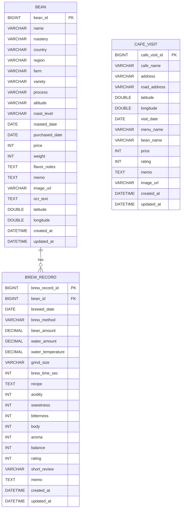
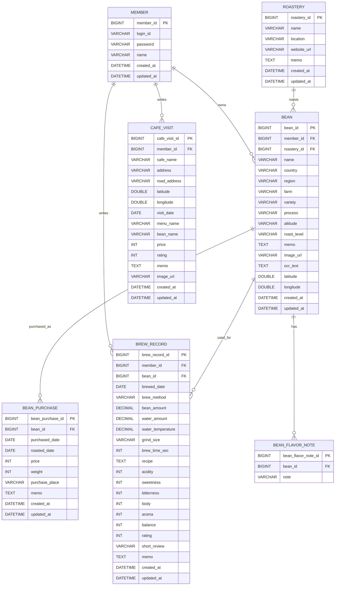

# BrewLog ERD 및 백엔드 도메인 설계 v1.0

## 1. 문서 개요

이 문서는 브루잉 커피 기록 웹 서비스 **BrewLog**의 ERD와 Spring Boot 기반 백엔드 도메인 설계를 정리한 문서이다.

프로젝트 명세서는 별도 문서에서 관리하고, 본 문서에서는 실제 구현을 위한 데이터 구조, 엔티티 관계, 패키지 구조, Repository, Service, DTO, Controller URL, 예외 설계를 다룬다.

---

## 2. 설계 방향

BrewLog의 핵심 데이터는 다음 세 가지이다.

1. 사용자가 구매하거나 기록한 **원두 정보**
2. 원두를 사용해 직접 내린 **브루잉 기록**
3. 카페에서 마신 커피를 기록하는 **카페 방문 기록**

초기 MVP에서는 구현 복잡도를 낮추기 위해 다음 구조로 시작한다.

```text
Bean 1 ─── N BrewRecord
CafeVisit 독립 관리
```

확장 버전에서는 로그인, 로스터리, 원두 구매 기록, 향미 노트 등을 별도 도메인으로 분리할 수 있다.

```text
Member 1 ─── N Bean
Member 1 ─── N BrewRecord
Member 1 ─── N CafeVisit
Roastery 1 ─── N Bean
Bean 1 ─── N BeanPurchase
Bean 1 ─── N BrewRecord
Bean 1 ─── N BeanFlavorNote
```

---

# 3. MVP 기준 ERD

MVP에서는 개인용 단일 사용자 서비스로 시작하는 것을 기준으로 한다.  
따라서 `Member` 테이블은 우선 제외한다.

## 3.1 MVP ERD 다이어그램



## 3.2 MVP 테이블 구성

```text
bean
brew_record
cafe_visit
```

## 3.3 MVP 관계

| 관계 | 설명 |
|---|---|
| Bean 1 : N BrewRecord | 하나의 원두는 여러 개의 브루잉 기록을 가질 수 있다. |
| CafeVisit 독립 | 카페 방문 기록은 직접 브루잉 기록과 성격이 달라 독립 엔티티로 관리한다. |

## 3.4 MVP에서 Member를 제외하는 이유

초기 목적이 개인 기록 서비스이므로 로그인 기능은 필수가 아니다.  
먼저 원두, 브루잉 기록, 카페 방문 기록의 CRUD를 완성한 뒤, 추후 다중 사용자 서비스로 확장할 때 `member_id`를 추가하는 것이 적절하다.

---

# 4. 확장 버전 ERD

로그인, 원두 구매 이력, 로스터리 관리, 향미 노트 태그화를 고려하면 다음 구조로 확장할 수 있다.

## 4.1 확장 ERD 다이어그램



## 4.2 확장 도메인 설명

| 도메인 | 설명 |
|---|---|
| Member | 다중 사용자 기능이 필요할 때 추가한다. |
| Roastery | 로스터리 정보를 별도로 관리할 때 추가한다. |
| BeanPurchase | 같은 원두를 여러 번 구매하는 이력을 관리할 때 추가한다. |
| BeanFlavorNote | 향미 노트를 태그처럼 검색/필터링하고 싶을 때 추가한다. |

---

# 5. MVP 데이터 모델 상세

## 5.1 Bean

원두 자체에 대한 정보를 관리한다.

```text
Bean
- id
- name
- roastery
- country
- region
- farm
- variety
- process
- altitude
- roastLevel
- roastedDate
- purchasedDate
- price
- weight
- flavorNotes
- memo
- imageUrl
- ocrText
- latitude
- longitude
- createdAt
- updatedAt
```

### 필드 설명

| 필드 | 설명 |
|---|---|
| name | 원두 이름. 필수값이다. |
| roastery | 로스터리 이름. MVP에서는 문자열로 관리한다. |
| country | 원두 생산 국가. 세계 지도 표시 기준이다. |
| region | 생산 지역. 예: Yirgacheffe, Huila |
| farm | 농장 또는 워싱스테이션 |
| variety | 품종. 예: Heirloom, Bourbon, Geisha |
| process | 가공 방식. 예: Washed, Natural |
| altitude | 고도. 예: 1,900m |
| roastLevel | 로스팅 정도 |
| roastedDate | 로스팅 날짜 |
| purchasedDate | 구매 날짜 |
| price | 구매 가격 |
| weight | 용량, g 단위 권장 |
| flavorNotes | 향미 노트. MVP에서는 문자열로 관리한다. |
| memo | 자유 메모 |
| imageUrl | 원두 이미지 경로 |
| ocrText | 원두 카드 이미지에서 추출한 OCR 원문 |
| latitude / longitude | 원산지 지도 확장용 좌표 |

---

## 5.2 BrewRecord

사용자가 직접 내린 커피 기록을 관리한다.

```text
BrewRecord
- id
- beanId
- brewedDate
- brewMethod
- beanAmount
- waterAmount
- waterTemperature
- grindSize
- brewTimeSec
- recipe
- acidity
- sweetness
- bitterness
- body
- aroma
- balance
- rating
- shortReview
- memo
- createdAt
- updatedAt
```

### 필드 설명

| 필드 | 설명 |
|---|---|
| beanId | 사용한 원두 ID. 필수값이다. |
| brewedDate | 추출 날짜. 필수값이다. |
| brewMethod | 추출 도구. 예: V60, Kalita, AeroPress |
| beanAmount | 원두 사용량, g |
| waterAmount | 물 사용량, ml |
| waterTemperature | 물 온도, ℃ |
| grindSize | 분쇄도 |
| brewTimeSec | 추출 시간, 초 단위 저장 권장 |
| recipe | 추출 레시피 |
| acidity | 산미 점수 |
| sweetness | 단맛 점수 |
| bitterness | 쓴맛 점수 |
| body | 바디감 점수 |
| aroma | 향 점수 |
| balance | 밸런스 점수 |
| rating | 전체 평점 |
| shortReview | 한줄 감상 |
| memo | 상세 메모 |

---

## 5.3 CafeVisit

카페에서 마신 커피 기록을 관리한다.

```text
CafeVisit
- id
- cafeName
- address
- roadAddress
- latitude
- longitude
- visitDate
- menuName
- beanName
- price
- rating
- memo
- imageUrl
- createdAt
- updatedAt
```

### 필드 설명

| 필드 | 설명 |
|---|---|
| cafeName | 카페 이름. 필수값이다. |
| address | 지번 주소 또는 사용자가 입력한 주소 |
| roadAddress | 도로명 주소 |
| latitude / longitude | 대한민국 지도 표시용 좌표 |
| visitDate | 방문 날짜. 필수값이다. |
| menuName | 마신 메뉴 이름 |
| beanName | 카페에서 사용한 원두 이름. 알 수 있는 경우 기록한다. |
| price | 가격 |
| rating | 만족도 평점 |
| memo | 방문 메모 |
| imageUrl | 카페 또는 커피 이미지 |

---

# 6. Spring Boot 패키지 구조

## 6.1 추천 패키지 구조

```text
com.example.brewlog
 ├── BrewlogApplication.java
 │
 ├── domain
 │   ├── bean
 │   │   ├── entity
 │   │   │   └── Bean.java
 │   │   ├── repository
 │   │   │   └── BeanRepository.java
 │   │   ├── service
 │   │   │   └── BeanService.java
 │   │   ├── controller
 │   │   │   └── BeanController.java
 │   │   ├── dto
 │   │   │   ├── BeanCreateForm.java
 │   │   │   ├── BeanUpdateForm.java
 │   │   │   ├── BeanDetailResponse.java
 │   │   │   └── BeanListResponse.java
 │   │   └── exception
 │   │       ├── BeanException.java
 │   │       └── BeanErrorCode.java
 │   │
 │   ├── brewrecord
 │   │   ├── entity
 │   │   │   └── BrewRecord.java
 │   │   ├── repository
 │   │   │   └── BrewRecordRepository.java
 │   │   ├── service
 │   │   │   └── BrewRecordService.java
 │   │   ├── controller
 │   │   │   └── BrewRecordController.java
 │   │   ├── dto
 │   │   │   ├── BrewRecordCreateForm.java
 │   │   │   ├── BrewRecordUpdateForm.java
 │   │   │   ├── BrewRecordDetailResponse.java
 │   │   │   └── BrewRecordListResponse.java
 │   │   └── exception
 │   │       ├── BrewRecordException.java
 │   │       └── BrewRecordErrorCode.java
 │   │
 │   ├── cafevisit
 │   │   ├── entity
 │   │   │   └── CafeVisit.java
 │   │   ├── repository
 │   │   │   └── CafeVisitRepository.java
 │   │   ├── service
 │   │   │   └── CafeVisitService.java
 │   │   ├── controller
 │   │   │   └── CafeVisitController.java
 │   │   ├── dto
 │   │   │   ├── CafeVisitCreateForm.java
 │   │   │   ├── CafeVisitUpdateForm.java
 │   │   │   ├── CafeVisitDetailResponse.java
 │   │   │   └── CafeVisitListResponse.java
 │   │   └── exception
 │   │       ├── CafeVisitException.java
 │   │       └── CafeVisitErrorCode.java
 │   │
 │   └── dashboard
 │       ├── controller
 │       │   └── DashboardController.java
 │       ├── service
 │       │   └── DashboardService.java
 │       └── dto
 │           └── DashboardResponse.java
 │
 ├── global
 │   ├── entity
 │   │   └── BaseTimeEntity.java
 │   ├── exception
 │   │   ├── BaseException.java
 │   │   ├── ErrorCode.java
 │   │   ├── ErrorResponseDto.java
 │   │   └── GlobalExceptionHandler.java
 │   └── config
 │       └── WebConfig.java
```

---

# 7. 도메인 책임 설계

## 7.1 bean 도메인

원두 자체에 대한 정보를 담당한다.

책임:

- 원두 등록
- 원두 수정
- 원두 삭제
- 원두 상세 조회
- 원두 목록 검색
- 동일 원두 후보 조회
- 원두 지도용 국가별 데이터 조회

## 7.2 brewrecord 도메인

직접 내린 커피 기록을 담당한다.

책임:

- 브루잉 기록 등록
- 브루잉 기록 수정
- 브루잉 기록 삭제
- 브루잉 기록 목록 조회
- 원두별 브루잉 기록 조회
- 추출 도구별 통계 조회

## 7.3 cafevisit 도메인

카페에서 마신 커피 기록을 담당한다.

책임:

- 카페 방문 기록 등록
- 카페 방문 기록 수정
- 카페 방문 기록 삭제
- 카페 방문 목록 조회
- 지도 마커 데이터 조회
- 지역별 카페 방문 통계 조회

## 7.4 dashboard 도메인

여러 도메인의 데이터를 모아 요약 통계를 제공한다.

책임:

- 전체 원두 수 조회
- 전체 브루잉 기록 수 조회
- 전체 카페 방문 수 조회
- 평균 평점 조회
- 가장 많이 마신 국가 조회
- 가장 많이 사용한 추출 도구 조회
- 최근 기록 조회

---

# 8. 엔티티 설계 초안

## 8.1 BaseTimeEntity

모든 엔티티에서 공통으로 사용하는 생성일, 수정일을 관리한다.

```java
@MappedSuperclass
@EntityListeners(AuditingEntityListener.class)
@Getter
public abstract class BaseTimeEntity {

    @CreatedDate
    @Column(updatable = false)
    private LocalDateTime createdAt;

    @LastModifiedDate
    private LocalDateTime updatedAt;
}
```

---

## 8.2 Bean 엔티티

```java
@Entity
@Getter
@NoArgsConstructor(access = AccessLevel.PROTECTED)
public class Bean extends BaseTimeEntity {

    @Id
    @GeneratedValue(strategy = GenerationType.IDENTITY)
    @Column(name = "bean_id")
    private Long id;

    @Column(nullable = false, length = 100)
    private String name;

    @Column(length = 100)
    private String roastery;

    @Column(length = 50)
    private String country;

    @Column(length = 100)
    private String region;

    @Column(length = 100)
    private String farm;

    @Column(length = 100)
    private String variety;

    @Column(length = 50)
    private String process;

    @Column(length = 50)
    private String altitude;

    @Column(length = 50)
    private String roastLevel;

    private LocalDate roastedDate;

    private LocalDate purchasedDate;

    private Integer price;

    private Integer weight;

    @Lob
    private String flavorNotes;

    @Lob
    private String memo;

    private String imageUrl;

    @Lob
    private String ocrText;

    private Double latitude;

    private Double longitude;

    @OneToMany(mappedBy = "bean")
    private List<BrewRecord> brewRecords = new ArrayList<>();

    public Bean(String name, String roastery, String country, String region,
                String farm, String variety, String process, String altitude,
                String roastLevel, LocalDate roastedDate, LocalDate purchasedDate,
                Integer price, Integer weight, String flavorNotes, String memo,
                String imageUrl, String ocrText, Double latitude, Double longitude) {
        validateName(name);
        this.name = name;
        this.roastery = roastery;
        this.country = country;
        this.region = region;
        this.farm = farm;
        this.variety = variety;
        this.process = process;
        this.altitude = altitude;
        this.roastLevel = roastLevel;
        this.roastedDate = roastedDate;
        this.purchasedDate = purchasedDate;
        this.price = price;
        this.weight = weight;
        this.flavorNotes = flavorNotes;
        this.memo = memo;
        this.imageUrl = imageUrl;
        this.ocrText = ocrText;
        this.latitude = latitude;
        this.longitude = longitude;
    }

    public void update(String name, String roastery, String country, String region,
                       String farm, String variety, String process, String altitude,
                       String roastLevel, LocalDate roastedDate, LocalDate purchasedDate,
                       Integer price, Integer weight, String flavorNotes, String memo,
                       String imageUrl, Double latitude, Double longitude) {
        validateName(name);
        this.name = name;
        this.roastery = roastery;
        this.country = country;
        this.region = region;
        this.farm = farm;
        this.variety = variety;
        this.process = process;
        this.altitude = altitude;
        this.roastLevel = roastLevel;
        this.roastedDate = roastedDate;
        this.purchasedDate = purchasedDate;
        this.price = price;
        this.weight = weight;
        this.flavorNotes = flavorNotes;
        this.memo = memo;
        this.imageUrl = imageUrl;
        this.latitude = latitude;
        this.longitude = longitude;
    }

    private void validateName(String name) {
        if (name == null || name.isBlank()) {
            throw new IllegalArgumentException("원두 이름은 필수입니다.");
        }
        if (name.length() > 100) {
            throw new IllegalArgumentException("원두 이름은 100자 이하로 입력해야 합니다.");
        }
    }
}
```

### 설계 포인트

- 원두 이름은 필수값이다.
- `flavorNotes`는 MVP에서는 문자열로 관리한다.
- `ocrText`는 OCR 원문 저장용이다.
- `latitude`, `longitude`는 원산지 지도 확장용이다.
- 원두 삭제 시 연결된 브루잉 기록이 있으면 삭제를 막는 정책을 서비스에서 적용한다.

---

## 8.3 BrewRecord 엔티티

```java
@Entity
@Getter
@NoArgsConstructor(access = AccessLevel.PROTECTED)
public class BrewRecord extends BaseTimeEntity {

    @Id
    @GeneratedValue(strategy = GenerationType.IDENTITY)
    @Column(name = "brew_record_id")
    private Long id;

    @ManyToOne(fetch = FetchType.LAZY)
    @JoinColumn(name = "bean_id", nullable = false)
    private Bean bean;

    @Column(nullable = false)
    private LocalDate brewedDate;

    @Column(nullable = false, length = 50)
    private String brewMethod;

    private BigDecimal beanAmount;

    private BigDecimal waterAmount;

    private BigDecimal waterTemperature;

    @Column(length = 100)
    private String grindSize;

    private Integer brewTimeSec;

    @Lob
    private String recipe;

    private Integer acidity;

    private Integer sweetness;

    private Integer bitterness;

    private Integer body;

    private Integer aroma;

    private Integer balance;

    private Integer rating;

    @Column(length = 255)
    private String shortReview;

    @Lob
    private String memo;

    public BrewRecord(Bean bean, LocalDate brewedDate, String brewMethod,
                      BigDecimal beanAmount, BigDecimal waterAmount, BigDecimal waterTemperature,
                      String grindSize, Integer brewTimeSec, String recipe,
                      Integer acidity, Integer sweetness, Integer bitterness,
                      Integer body, Integer aroma, Integer balance, Integer rating,
                      String shortReview, String memo) {
        validate(bean, brewedDate, brewMethod, rating);
        this.bean = bean;
        this.brewedDate = brewedDate;
        this.brewMethod = brewMethod;
        this.beanAmount = beanAmount;
        this.waterAmount = waterAmount;
        this.waterTemperature = waterTemperature;
        this.grindSize = grindSize;
        this.brewTimeSec = brewTimeSec;
        this.recipe = recipe;
        this.acidity = acidity;
        this.sweetness = sweetness;
        this.bitterness = bitterness;
        this.body = body;
        this.aroma = aroma;
        this.balance = balance;
        this.rating = rating;
        this.shortReview = shortReview;
        this.memo = memo;
    }

    public void update(LocalDate brewedDate, String brewMethod,
                       BigDecimal beanAmount, BigDecimal waterAmount, BigDecimal waterTemperature,
                       String grindSize, Integer brewTimeSec, String recipe,
                       Integer acidity, Integer sweetness, Integer bitterness,
                       Integer body, Integer aroma, Integer balance, Integer rating,
                       String shortReview, String memo) {
        validate(this.bean, brewedDate, brewMethod, rating);
        this.brewedDate = brewedDate;
        this.brewMethod = brewMethod;
        this.beanAmount = beanAmount;
        this.waterAmount = waterAmount;
        this.waterTemperature = waterTemperature;
        this.grindSize = grindSize;
        this.brewTimeSec = brewTimeSec;
        this.recipe = recipe;
        this.acidity = acidity;
        this.sweetness = sweetness;
        this.bitterness = bitterness;
        this.body = body;
        this.aroma = aroma;
        this.balance = balance;
        this.rating = rating;
        this.shortReview = shortReview;
        this.memo = memo;
    }

    private void validate(Bean bean, LocalDate brewedDate, String brewMethod, Integer rating) {
        if (bean == null) {
            throw new IllegalArgumentException("브루잉 기록에는 원두가 필요합니다.");
        }
        if (brewedDate == null) {
            throw new IllegalArgumentException("추출 날짜는 필수입니다.");
        }
        if (brewMethod == null || brewMethod.isBlank()) {
            throw new IllegalArgumentException("추출 도구는 필수입니다.");
        }
        if (rating != null && (rating < 1 || rating > 5)) {
            throw new IllegalArgumentException("평점은 1점 이상 5점 이하로 입력해야 합니다.");
        }
    }
}
```

### 설계 포인트

- 브루잉 기록은 반드시 하나의 Bean에 연결된다.
- `beanAmount`, `waterAmount`, `waterTemperature`는 소수점 입력 가능성을 고려해 `BigDecimal`을 사용한다.
- 평점은 MVP 기준 1~5점으로 제한한다.

---

## 8.4 CafeVisit 엔티티

```java
@Entity
@Getter
@NoArgsConstructor(access = AccessLevel.PROTECTED)
public class CafeVisit extends BaseTimeEntity {

    @Id
    @GeneratedValue(strategy = GenerationType.IDENTITY)
    @Column(name = "cafe_visit_id")
    private Long id;

    @Column(nullable = false, length = 100)
    private String cafeName;

    @Column(length = 255)
    private String address;

    @Column(length = 255)
    private String roadAddress;

    private Double latitude;

    private Double longitude;

    @Column(nullable = false)
    private LocalDate visitDate;

    @Column(length = 100)
    private String menuName;

    @Column(length = 100)
    private String beanName;

    private Integer price;

    private Integer rating;

    @Lob
    private String memo;

    private String imageUrl;

    public CafeVisit(String cafeName, String address, String roadAddress,
                     Double latitude, Double longitude, LocalDate visitDate,
                     String menuName, String beanName, Integer price,
                     Integer rating, String memo, String imageUrl) {
        validate(cafeName, visitDate, rating);
        this.cafeName = cafeName;
        this.address = address;
        this.roadAddress = roadAddress;
        this.latitude = latitude;
        this.longitude = longitude;
        this.visitDate = visitDate;
        this.menuName = menuName;
        this.beanName = beanName;
        this.price = price;
        this.rating = rating;
        this.memo = memo;
        this.imageUrl = imageUrl;
    }

    public void update(String cafeName, String address, String roadAddress,
                       Double latitude, Double longitude, LocalDate visitDate,
                       String menuName, String beanName, Integer price,
                       Integer rating, String memo, String imageUrl) {
        validate(cafeName, visitDate, rating);
        this.cafeName = cafeName;
        this.address = address;
        this.roadAddress = roadAddress;
        this.latitude = latitude;
        this.longitude = longitude;
        this.visitDate = visitDate;
        this.menuName = menuName;
        this.beanName = beanName;
        this.price = price;
        this.rating = rating;
        this.memo = memo;
        this.imageUrl = imageUrl;
    }

    private void validate(String cafeName, LocalDate visitDate, Integer rating) {
        if (cafeName == null || cafeName.isBlank()) {
            throw new IllegalArgumentException("카페 이름은 필수입니다.");
        }
        if (visitDate == null) {
            throw new IllegalArgumentException("방문 날짜는 필수입니다.");
        }
        if (rating != null && (rating < 1 || rating > 5)) {
            throw new IllegalArgumentException("평점은 1점 이상 5점 이하로 입력해야 합니다.");
        }
    }
}
```

### 설계 포인트

- 카페 방문 기록은 Bean과 직접 연결하지 않는다.
- 카페에서 마신 원두를 알 경우 `beanName`에 문자열로 기록한다.
- 지도 표시를 위해 `latitude`, `longitude`를 둔다.
- 주소만 있고 좌표가 없는 경우 지도에는 표시하지 않고 목록에는 표시할 수 있다.

---

# 9. Repository 설계

## 9.1 BeanRepository

```java
public interface BeanRepository extends JpaRepository<Bean, Long> {

    List<Bean> findByNameContainingIgnoreCase(String name);

    List<Bean> findByRoasteryContainingIgnoreCase(String roastery);

    List<Bean> findByCountry(String country);

    List<Bean> findByProcess(String process);

    List<Bean> findByNameContainingIgnoreCaseOrRoasteryContainingIgnoreCase(
            String name,
            String roastery
    );

    long countByCountry(String country);

    @Query("SELECT b.country, COUNT(b) FROM Bean b WHERE b.country IS NOT NULL GROUP BY b.country")
    List<Object[]> countBeansGroupByCountry();
}
```

### 용도

- 원두 목록 검색
- 국가별 원두 통계
- 세계 지도 표시용 데이터 생성
- 동일 원두 후보 조회

---

## 9.2 BrewRecordRepository

```java
public interface BrewRecordRepository extends JpaRepository<BrewRecord, Long> {

    List<BrewRecord> findByBeanId(Long beanId);

    List<BrewRecord> findByBrewMethod(String brewMethod);

    List<BrewRecord> findByBrewedDateBetween(LocalDate startDate, LocalDate endDate);

    long countByBeanId(Long beanId);

    @Query("SELECT AVG(br.rating) FROM BrewRecord br WHERE br.bean.id = :beanId AND br.rating IS NOT NULL")
    Double findAverageRatingByBeanId(@Param("beanId") Long beanId);

    @Query("SELECT br.brewMethod, COUNT(br) FROM BrewRecord br GROUP BY br.brewMethod ORDER BY COUNT(br) DESC")
    List<Object[]> countGroupByBrewMethod();
}
```

### 용도

- 원두별 브루잉 기록 조회
- 평균 평점 계산
- 추출 도구별 통계
- 기간별 기록 조회

---

## 9.3 CafeVisitRepository

```java
public interface CafeVisitRepository extends JpaRepository<CafeVisit, Long> {

    List<CafeVisit> findByCafeNameContainingIgnoreCase(String cafeName);

    List<CafeVisit> findByVisitDateBetween(LocalDate startDate, LocalDate endDate);

    @Query("SELECT cv.cafeName, COUNT(cv) FROM CafeVisit cv GROUP BY cv.cafeName ORDER BY COUNT(cv) DESC")
    List<Object[]> countGroupByCafeName();

    @Query("SELECT cv FROM CafeVisit cv WHERE cv.latitude IS NOT NULL AND cv.longitude IS NOT NULL")
    List<CafeVisit> findAllWithLocation();
}
```

### 용도

- 카페 방문 검색
- 카페 지도 마커 데이터 조회
- 카페별 방문 횟수 통계

---

# 10. Service 설계

## 10.1 BeanService 책임

```text
BeanService
- saveBean(form)
- updateBean(beanId, form)
- deleteBean(beanId)
- findBean(beanId)
- findBeans(keyword, country, process, sort)
- findDuplicateCandidates(form)
- getBeanMapData()
```

### 주요 비즈니스 규칙

- 원두 이름은 필수다.
- 원두 삭제 시 연결된 브루잉 기록이 있으면 삭제를 막는다.
- 동일 원두 여부는 자동 확정하지 않고 후보만 반환한다.
- 지도 데이터는 country가 있는 원두만 대상으로 한다.

### 삭제 정책 예시

```java
@Transactional
public void deleteBean(Long beanId) {
    Bean bean = findBeanEntity(beanId);

    if (brewRecordRepository.countByBeanId(beanId) > 0) {
        throw new BeanException(BeanErrorCode.BEAN_HAS_BREW_RECORDS);
    }

    beanRepository.delete(bean);
}
```

---

## 10.2 BrewRecordService 책임

```text
BrewRecordService
- saveBrewRecord(form)
- updateBrewRecord(recordId, form)
- deleteBrewRecord(recordId)
- findBrewRecord(recordId)
- findBrewRecords(keyword, brewMethod, startDate, endDate, sort)
- findRecordsByBean(beanId)
```

### 주요 비즈니스 규칙

- 브루잉 기록은 반드시 원두에 연결되어야 한다.
- 추출 날짜와 추출 도구는 필수다.
- 평점은 1~5 범위여야 한다.
- 원두가 삭제되면 연결된 브루잉 기록은 유지될 수 없으므로 원두 삭제를 제한한다.

---

## 10.3 CafeVisitService 책임

```text
CafeVisitService
- saveCafeVisit(form)
- updateCafeVisit(visitId, form)
- deleteCafeVisit(visitId)
- findCafeVisit(visitId)
- findCafeVisits(keyword, region, startDate, endDate, sort)
- getCafeMapData()
```

### 주요 비즈니스 규칙

- 카페 이름과 방문 날짜는 필수다.
- 평점은 1~5 범위여야 한다.
- 좌표가 있는 카페 방문 기록만 지도 마커 데이터로 제공한다.
- 주소만 있는 경우 추후 지오코딩으로 좌표를 채울 수 있다.

---

## 10.4 DashboardService 책임

```text
DashboardService
- getDashboardSummary()
- getTotalBeanCount()
- getTotalBrewRecordCount()
- getTotalCafeVisitCount()
- getAverageRating()
- getMostUsedBrewMethod()
- getMostRecordedCountry()
- getRecentBrewRecords()
- getRecentBeans()
- getRecentCafeVisits()
```

### 주요 비즈니스 규칙

- 여러 Repository를 조합하여 요약 데이터를 만든다.
- 평균값이 없는 경우 0 또는 `-`로 표시한다.
- 최근 기록은 생성일 또는 기록일 기준으로 조회한다.

---

# 11. DTO 설계 초안

## 11.1 BeanCreateForm

```java
@Getter
@Setter
public class BeanCreateForm {

    @NotBlank(message = "원두 이름은 필수입니다.")
    @Size(max = 100, message = "원두 이름은 100자 이하로 입력해야 합니다.")
    private String name;

    private String roastery;
    private String country;
    private String region;
    private String farm;
    private String variety;
    private String process;
    private String altitude;
    private String roastLevel;

    @DateTimeFormat(pattern = "yyyy-MM-dd")
    private LocalDate roastedDate;

    @DateTimeFormat(pattern = "yyyy-MM-dd")
    private LocalDate purchasedDate;

    private Integer price;
    private Integer weight;
    private String flavorNotes;
    private String memo;
    private String imageUrl;
    private String ocrText;
    private Double latitude;
    private Double longitude;
}
```

---

## 11.2 BrewRecordCreateForm

```java
@Getter
@Setter
public class BrewRecordCreateForm {

    @NotNull(message = "원두를 선택해야 합니다.")
    private Long beanId;

    @NotNull(message = "추출 날짜는 필수입니다.")
    @DateTimeFormat(pattern = "yyyy-MM-dd")
    private LocalDate brewedDate;

    @NotBlank(message = "추출 도구는 필수입니다.")
    private String brewMethod;

    private BigDecimal beanAmount;
    private BigDecimal waterAmount;
    private BigDecimal waterTemperature;
    private String grindSize;
    private Integer brewTimeSec;
    private String recipe;

    @Min(1)
    @Max(5)
    private Integer acidity;

    @Min(1)
    @Max(5)
    private Integer sweetness;

    @Min(1)
    @Max(5)
    private Integer bitterness;

    @Min(1)
    @Max(5)
    private Integer body;

    @Min(1)
    @Max(5)
    private Integer aroma;

    @Min(1)
    @Max(5)
    private Integer balance;

    @Min(1)
    @Max(5)
    private Integer rating;

    private String shortReview;
    private String memo;
}
```

---

## 11.3 CafeVisitCreateForm

```java
@Getter
@Setter
public class CafeVisitCreateForm {

    @NotBlank(message = "카페 이름은 필수입니다.")
    private String cafeName;

    private String address;
    private String roadAddress;
    private Double latitude;
    private Double longitude;

    @NotNull(message = "방문 날짜는 필수입니다.")
    @DateTimeFormat(pattern = "yyyy-MM-dd")
    private LocalDate visitDate;

    private String menuName;
    private String beanName;
    private Integer price;

    @Min(1)
    @Max(5)
    private Integer rating;

    private String memo;
    private String imageUrl;
}
```

---

# 12. Controller URL 설계

## 12.1 화면 기반 SSR URL 설계

Thymeleaf SSR 기준 URL은 다음과 같이 설계할 수 있다.

```text
GET  /                      홈
GET  /dashboard             대시보드

GET  /beans                 원두 목록
GET  /beans/new             원두 등록 화면
POST /beans                 원두 등록 처리
GET  /beans/{beanId}        원두 상세
GET  /beans/{beanId}/edit   원두 수정 화면
POST /beans/{beanId}/edit   원두 수정 처리
POST /beans/{beanId}/delete 원두 삭제

GET  /brew-records                    브루잉 기록 목록
GET  /brew-records/new                브루잉 기록 등록 화면
POST /brew-records                    브루잉 기록 등록 처리
GET  /brew-records/{recordId}         브루잉 기록 상세
GET  /brew-records/{recordId}/edit    브루잉 기록 수정 화면
POST /brew-records/{recordId}/edit    브루잉 기록 수정 처리
POST /brew-records/{recordId}/delete  브루잉 기록 삭제

GET  /cafe-visits                   카페 방문 목록
GET  /cafe-visits/new               카페 방문 등록 화면
POST /cafe-visits                   카페 방문 등록 처리
GET  /cafe-visits/{visitId}         카페 방문 상세
GET  /cafe-visits/{visitId}/edit    카페 방문 수정 화면
POST /cafe-visits/{visitId}/edit    카페 방문 수정 처리
POST /cafe-visits/{visitId}/delete  카페 방문 삭제

GET  /maps/beans       원두 세계 지도
GET  /maps/cafes       카페 방문 대한민국 지도
```

---

## 12.2 지도 데이터 API URL

지도 화면에서는 JavaScript로 마커 데이터를 가져와야 하므로 JSON API를 함께 제공하는 것이 좋다.

```text
GET /api/maps/beans
GET /api/maps/cafes
```

### `/api/maps/beans` 응답 예시

```json
[
  {
    "country": "Ethiopia",
    "count": 4,
    "latitude": 9.145,
    "longitude": 40.489673,
    "beans": [
      {
        "id": 1,
        "name": "Ethiopia Chelbesa Washed",
        "rating": 4
      }
    ]
  }
]
```

### `/api/maps/cafes` 응답 예시

```json
[
  {
    "id": 1,
    "cafeName": "프릳츠 원서점",
    "latitude": 37.577,
    "longitude": 126.987,
    "visitDate": "2026-05-03",
    "menuName": "핸드드립",
    "rating": 5
  }
]
```

---

# 13. 예외 설계 초안

## 13.1 공통 ErrorCode

```java
public interface ErrorCode {
    String getCode();
    String getMessage();
    HttpStatus getStatus();
}
```

## 13.2 BaseException

```java
@Getter
public class BaseException extends RuntimeException {

    private final ErrorCode errorCode;

    public BaseException(ErrorCode errorCode) {
        super(errorCode.getMessage());
        this.errorCode = errorCode;
    }
}
```

## 13.3 BeanErrorCode 예시

```java
@Getter
@RequiredArgsConstructor
public enum BeanErrorCode implements ErrorCode {

    BEAN_NOT_FOUND("BEAN_001", "원두를 찾을 수 없습니다.", HttpStatus.NOT_FOUND),
    BEAN_HAS_BREW_RECORDS("BEAN_002", "브루잉 기록이 있는 원두는 삭제할 수 없습니다.", HttpStatus.BAD_REQUEST),
    INVALID_BEAN_NAME("BEAN_003", "원두 이름이 올바르지 않습니다.", HttpStatus.BAD_REQUEST);

    private final String code;
    private final String message;
    private final HttpStatus status;
}
```

## 13.4 BrewRecordErrorCode 예시

```java
@Getter
@RequiredArgsConstructor
public enum BrewRecordErrorCode implements ErrorCode {

    BREW_RECORD_NOT_FOUND("BREW_001", "브루잉 기록을 찾을 수 없습니다.", HttpStatus.NOT_FOUND),
    INVALID_RATING("BREW_002", "평점은 1점 이상 5점 이하로 입력해야 합니다.", HttpStatus.BAD_REQUEST);

    private final String code;
    private final String message;
    private final HttpStatus status;
}
```

## 13.5 CafeVisitErrorCode 예시

```java
@Getter
@RequiredArgsConstructor
public enum CafeVisitErrorCode implements ErrorCode {

    CAFE_VISIT_NOT_FOUND("CAFE_001", "카페 방문 기록을 찾을 수 없습니다.", HttpStatus.NOT_FOUND),
    INVALID_CAFE_NAME("CAFE_002", "카페 이름이 올바르지 않습니다.", HttpStatus.BAD_REQUEST);

    private final String code;
    private final String message;
    private final HttpStatus status;
}
```

---

# 14. 구현 우선순위 추천

## 14.1 1차 구현

가장 먼저 구현할 핵심 도메인이다.

```text
Bean
BrewRecord
CafeVisit
Dashboard
```

구현 순서:

1. BaseTimeEntity
2. Bean 엔티티 / Repository / Service / Controller
3. BrewRecord 엔티티 / Repository / Service / Controller
4. CafeVisit 엔티티 / Repository / Service / Controller
5. DashboardService
6. 기본 Thymeleaf 화면

---

## 14.2 2차 구현

기본 기록 기능이 완성된 뒤 구현한다.

```text
검색 / 필터 / 정렬
지도 JSON API
세계 지도 화면
대한민국 지도 화면
```

---

## 14.3 3차 구현

프로젝트 완성도를 높이는 기능이다.

```text
OCR 이미지 업로드
OCR 텍스트 추출
원두 정보 자동 매핑
동일 원두 후보 추천
```

---

# 15. 최종 추천 설계

초기 버전에서는 다음 구조를 가장 추천한다.

```text
도메인:
- Bean
- BrewRecord
- CafeVisit
- Dashboard

테이블:
- bean
- brew_record
- cafe_visit

관계:
- Bean 1 : N BrewRecord
- CafeVisit은 독립 엔티티
```

이 구조가 좋은 이유는 다음과 같다.

- 구현 난이도가 낮다.
- 핵심 기능을 빠르게 완성할 수 있다.
- 나중에 Member, Roastery, BeanPurchase를 추가하기 쉽다.
- 지도 기능과 통계 기능을 붙이기 쉽다.
- OCR 자동 입력 기능도 Bean 도메인에 자연스럽게 연결된다.

따라서 MVP에서는 `Bean`, `BrewRecord`, `CafeVisit` 세 도메인을 중심으로 개발하고, 이후 기능 확장 시 `Member`, `Roastery`, `BeanPurchase`, `FlavorNote`를 분리하는 방향이 적절하다.

